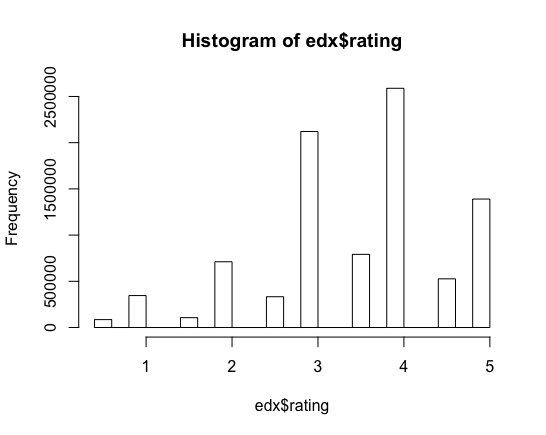
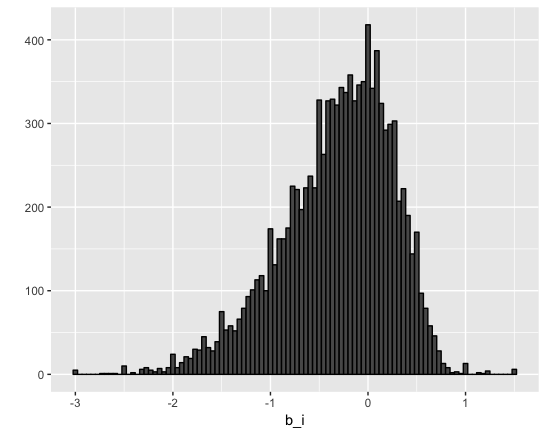
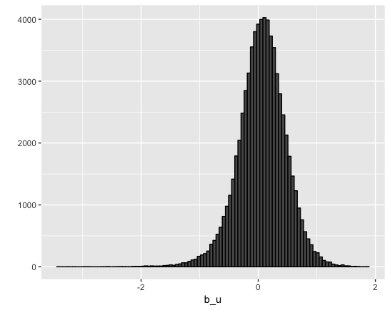
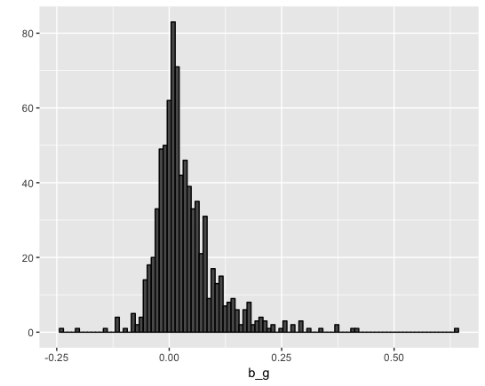
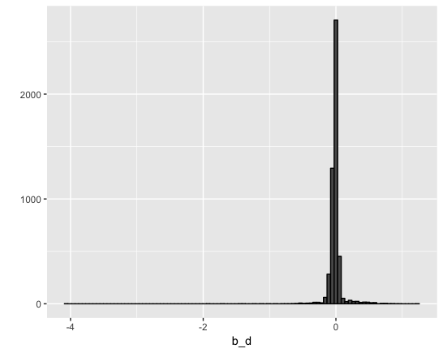
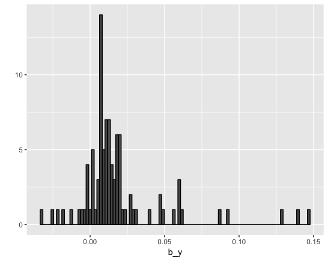
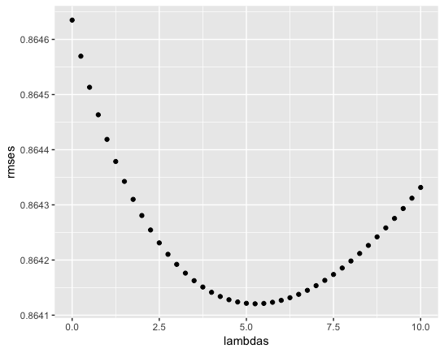

```{r setup, include=FALSE}
knitr::opts_chunk$set(echo = TRUE, eval = FALSE)
```

## Executive summary section

### describes the dataset 

The MovieLens dataset is a dataset collected by the University of Minnesota's GroupLens Research project for research and benchmarking of personalized recommendations systems.

#### Ratings Data File Structure

All ratings are contained in the file ratings.dat. Each line of this file represents one rating of one movie by one user, and has the following format:

UserID::MovieID::Rating::Timestamp

The lines within this file are ordered first by UserID, then, within the user, by MovieID.

Ratings are made on a 5-star scale, with half-star increments.

Timestamps represent seconds since midnight Coordinated Universal Time (UTC) of January 1, 1970.

#### Movies Data File Structure

Movie information is contained in the file movies.dat. Each line of this file represents one movie, and has the following format:

MovieID::Title::Genres

MovieID is the real MovieLens id.

Movie titles, by policy, should be entered identically to those found in IMDB, including the year of release. However, they are entered manually, so errors and inconsistencies may exist.

Genres are a pipe-separated list, and are selected from the following:

* Action
* Adventure
* Animation
* Children's
* Comedy
* Crime
* Documentary
* Drama
* Fantasy
* Film-Noir
* Horror
* Musical
* Mystery
* Romance
* Sci-Fi
* Thriller
* War
* Western

#### The edx set and validation set

I will create the edx set and the validation set.

The edx set is used to develop my algorithm.

The validation set is used to evaluate how close your predictions are to the true values.

### The goal of the project

For this project, I'll be creating a movie recommendation system using the MovieLens dataset.

My movie rating predictions will be compared to the true ratings in the validation set using RMSE. 

### Key steps that were performed

1. Add release year and days from initial post to the datasets

2. develop my algorithm
    1. Just The Average Model
    2. Movie Effect Model
    3. Movie + User Effects Model
    4. Movie + User + Genres Effects Model
    5. Movie + User + Genres + Days Effects Model
    6. Movie + User + Genres + Days + Release year Effects Model
    7. Regularized Movie + User + Genres + Days + Release year Effects Model


## Methods section

### Generate the edx set and the validation set

I use the following code to generate the edx set and the validation set. 

```{R}
# Create test and validation sets
#############################################################
# Create edx set, validation set, and submission file
#############################################################

# Note: this process could take a couple of minutes

if(!require(tidyverse)) install.packages("tidyverse", repos = "http://cran.us.r-project.org")
if(!require(caret)) install.packages("caret", repos = "http://cran.us.r-project.org")

# MovieLens 10M dataset:
# https://grouplens.org/datasets/movielens/10m/
# http://files.grouplens.org/datasets/movielens/ml-10m.zip

dl <- tempfile()
download.file("http://files.grouplens.org/datasets/movielens/ml-10m.zip", dl)

ratings <- read.table(text = gsub("::", "\t", readLines(unzip(dl, "ml-10M100K/ratings.dat"))),
                      col.names = c("userId", "movieId", "rating", "timestamp"))

movies <- str_split_fixed(readLines(unzip(dl, "ml-10M100K/movies.dat")), "\\::", 3)
colnames(movies) <- c("movieId", "title", "genres")
movies <- as.data.frame(movies) %>% mutate(movieId = as.numeric(levels(movieId))[movieId],
                                           title = as.character(title),
                                           genres = as.character(genres))

movielens <- left_join(ratings, movies, by = "movieId")

# Validation set will be 10% of MovieLens data

set.seed(1)
test_index <- createDataPartition(y = movielens$rating, times = 1, p = 0.1, list = FALSE)
edx <- movielens[-test_index,]
temp <- movielens[test_index,]

# Make sure userId and movieId in validation set are also in edx set

validation <- temp %>% 
     semi_join(edx, by = "movieId") %>%
     semi_join(edx, by = "userId")

# Add rows removed from validation set back into edx set

removed <- anti_join(temp, validation)
edx <- rbind(edx, removed)

rm(dl, ratings, movies, test_index, temp, movielens, removed)
```

### Add release year and days from initial post to the datasets

#### Release year

To extract the year of release from the title.

```{R}
edx <- 
  edx %>% 
  mutate(release_year = as.numeric(str_sub(title,-5,-2)))

validation <- 
  validation %>% 
  mutate(release_year = as.numeric(str_sub(title,-5,-2)))
```

#### Days from the initial post

Timestamps represent seconds since midnight Coordinated Universal Time (UTC) of January 1, 1970.

Convert timestamp to year-month-date

```{R}
edx <- 
  edx %>% 
  mutate(date = date(as.POSIXct(timestamp, tz = "UCT" ,origin = origin)))
  
validation <- 
  validation %>% 
  mutate(date = date(as.POSIXct(timestamp, tz = "UCT" ,origin = origin)))
```

Adding the number of days from the initial post.

```{R}
edx <- edx %>% 
  group_by(movieId) %>% 
  summarize(initial_post_day = min(date)) %>% 
  left_join(edx, by = "movieId") %>% 
  mutate(days = date - initial_post_day) %>% 
  select(-initial_post_day, -timestamp)

validation <- validation %>% 
  group_by(movieId) %>% 
  summarize(initial_post_day = min(date)) %>% 
  left_join(validation, by = "movieId") %>% 
  mutate(days = date - initial_post_day) %>% 
  select(-initial_post_day, -timestamp)
```

### Data exploration and visualization

The edx set's summary is as follows.

```{R}
edx %>% 
  mutate(movieId = as.factor(movieId),
         userId = as.factor(userId),
         genres = as.factor(genres),
         release_year = as.factor(release_year)) %>% 
         str(edx)
```

Classes ‘tbl_df’, ‘tbl’ and 'data.frame':	9000055 obs. of  8 variables:

 $ movieId     : Factor w/ 10677 levels "1","2","3","4",..: 1 1 1 1 1 1 1 1 1 1 ...
 
 $ userId      : Factor w/ 69878 levels "1","2","3","4",..: 5 14 17 20 21 26 27 29 30 36 ...
 
 $ rating      : num  1 3 3 5 5 5 4 3 4 4 ...
 
 $ title       : chr  "Toy Story (1995)" "Toy Story (1995)" "Toy Story (1995)" "Toy Story (1995)" ...
 
 $ genres      : Factor w/ 797 levels "(no genres listed)",..: 261 261 261 261 261 261 261 261 261 261 ...
 
 $ release_year: Factor w/ 94 levels "1915","1916",..: 81 81 81 81 81 81 81 81 81 81 ...
 
 $ date        : Date, format: "1997-03-09" "2005-12-03" ...
 
 $ days        :Class 'difftime'  atomic [1:9000055] 405 3596 3341 308 525 ...
 
  .. ..- attr(*, "units")= chr "days"

Rating's summary is as follow.

```{R}
summary(edx$rating)
hist(edx$rating)
```




\clearpage 

### RMSE

I write a function that computes the RMSE for vectors of ratings and their corresponding predictors:

```{R}
RMSE <- function(validation$rating, predicted_ratings){
    sqrt(mean((true_ratings - predicted_ratings)^2))
  }
```

### Just the average model

A model that assumes the same rating for all movies and users with all the differences explained by random variation.

All means average to "mu".

```{R}
mu <- mean(edx$rating)
mu_hat <- mu
model_1_rmse <- RMSE(validation$rating, mu_hat)
```

\clearpage 

### Movie effects model

I thought that the evaluation was different depending on the movie and made the following model.

```{R}
movie_avgs <- edx %>% 
  group_by(as.numeric(movieId)) %>% 
  summarize(b_i = mean(rating - mu)) 

movie_avgs %>% qplot(b_i, geom ="histogram", bins = 100, data = ., color = I("black"))
```




I have confirmed that the ratings are different depending on the movie, so I add it to the model.

```{R}
predicted_ratings <- mu + validation %>% 
  left_join(movie_avgs, by='movieId') %>%
  pull(b_i)

model_2_rmse <- RMSE(validation$rating, predicted_ratings)
```

\clearpage 

### Movie + User Effects Model

The following models were created because the ratings were different depending on the user.

```{R}
user_avgs <- edx %>% 
  left_join(movie_avgs, by='movieId') %>%
  group_by(userId) %>%
  summarize(b_u = mean(rating - mu - b_i))

user_avgs %>% qplot(b_u, geom ="histogram", bins = 100, data = ., color = I("black"))

predicted_ratings <- validation %>% 
  left_join(movie_avgs, by='movieId') %>%
  left_join(user_avgs, by='userId') %>%
  mutate(pred = mu + b_i + b_u) %>%
  pull(pred)

model_3_rmse <- RMSE(predicted_ratings, validation$rating)
```



\clearpage 

### Movie + User + Genres Effects Model

Considering that ratings differ depending on genres.

```{R}
genres_avgs <- edx %>% 
  left_join(movie_avgs, by='movieId') %>%
  left_join(user_avgs, by='userId') %>%
  group_by(genres) %>% 
  summarize(b_g = mean(rating - mu - b_i - b_u)) 

genres_avgs %>% qplot(b_g, geom ="histogram", bins = 100, data = ., color = I("black"))

predicted_ratings <- validation %>% 
  left_join(movie_avgs, by='movieId') %>%
  left_join(user_avgs, by='userId') %>%
  left_join(genres_avgs, by='genres') %>%
  mutate(pred = mu + b_i + b_u + b_g) %>% 
  pull(pred)

model_4_rmse <- RMSE(validation$rating, predicted_ratings)
```




\clearpage 

### Movie + User + Genres + Days Effects Model

Considering that the rating varies depending on the number of days since the movie's first post, the following model was created.

```{R}
days_avgs <- edx %>% 
  left_join(movie_avgs, by='movieId') %>%
  left_join(user_avgs, by='userId') %>%
  left_join(genres_avgs, by='genres') %>%
  group_by(days) %>% 
  summarize(b_d = mean(rating - mu - b_i - b_u - b_g))

days_avgs %>% qplot(b_d, geom ="histogram", bins = 100, data = ., color = I("black"))
  
predicted_ratings <- validation %>% 
  left_join(movie_avgs, by='movieId') %>%
  left_join(user_avgs, by='userId') %>%
  left_join(genres_avgs, by='genres') %>%
  left_join(days_avgs, by='days') %>%
  mutate(pred = mu + b_i + b_u + b_g + b_d) %>%
  pull(pred)

model_5_rmse <- RMSE(predicted_ratings, validation$rating)
```



\clearpage 

### Movie + User + Genres + Days + Release year Effects Model

Considering that the rating differs depending on the release year, the following model was created.

```{R}
release_avgs <- edx %>% 
  left_join(movie_avgs, by='movieId') %>%
  left_join(user_avgs, by='userId') %>%
  left_join(genres_avgs, by='genres') %>%
  left_join(days_avgs, by='days') %>%
  group_by(release_year) %>% 
  summarize(b_y = mean(rating - mu - b_i - b_u - b_g - b_d)) 

release_avgs %>% qplot(b_y, geom ="histogram", bins = 100, data = ., color = I("black"))

predicted_ratings <- validation %>% 
  left_join(movie_avgs, by='movieId') %>%
  left_join(user_avgs, by='userId') %>%
  left_join(genres_avgs, by='genres') %>%
  left_join(days_avgs, by='days') %>%
  left_join(release_avgs, by="release_year") %>%
  mutate(pred = mu + b_i + b_u + b_g + b_d + b_y) %>% 
  pull(pred)

model_6_rmse <- RMSE(predicted_ratings, validation$rating)
```



\clearpage 

### Regularized Movie + User + Genres + Days + Release year Effects Model

Regularized the following models for movies, users, genres, days, years of release.

Cross-validation was performed to select lambda.

```{R}
lambdas <- seq(0, 10, 0.25)
rmses <- sapply(lambdas, function(l){
  
  mu <- mean(edx$rating)
  
  b_i <- edx %>% 
    group_by(movieId) %>%
    summarize(b_i = sum(rating - mu)/(n()+l))
  
  b_u <- edx %>% 
    left_join(b_i, by="movieId") %>%
    group_by(userId) %>%
    summarize(b_u = sum(rating - b_i - mu)/(n()+l))
  
  b_g <- edx %>%
    left_join(b_i, by="movieId") %>%
    left_join(b_u, by="userId") %>%
    group_by(genres) %>%
    summarize(b_g = sum(rating -b_u - b_i - mu)/(n()+l))
  
  b_d <- edx %>% 
    left_join(b_i, by="movieId") %>%
    left_join(b_u, by="userId") %>%
    left_join(b_g, by="genres") %>%    
    group_by(days) %>%
    summarize(b_d = sum(rating - b_g - b_u - b_i - mu)/(n()+l))
  
  b_y <- edx %>% 
    left_join(b_i, by="movieId") %>%
    left_join(b_u, by="userId") %>%
    left_join(b_g, by="genres") %>% 
    left_join(b_d, by = "days") %>%
    group_by(release_year) %>%
    summarize(b_y = sum(rating - b_d - b_g - b_u -b_i - mu)/(n()+l))
  
  predicted_ratings <- 
    validation %>% 
    left_join(b_i, by = "movieId") %>%
    left_join(b_u, by = "userId") %>%
    left_join(b_g, by = "genres") %>%
    left_join(b_d, by = "days") %>%    
    left_join(b_y, by = "release_year") %>%
    mutate(pred = mu + b_i + b_u + b_g + b_d + b_y) %>%
    pull(pred)
  
  return(RMSE(predicted_ratings, validation$rating))
})

qplot(lambdas, rmses) 

lambda <- lambdas[which.min(rmses)]
lambda

model_7_rmse <- min(rmses)
```



## Results section

Store all results in a data frame.

```{R}
rmse_results <- bind_rows(
  data_frame(method = "Just the average Model", 
             RMSE = model_1_rmse),
  data_frame(method = "Movie Effect Model", 
             RMSE = model_2_rmse),
  data_frame(method = "Movie + User Effects Model", 
             RMSE = model_3_rmse),
  data_frame(method = "Movie + User + Genres Effects Model", 
             RMSE = model_4_rmse),
  data_frame(method = "Movie + User + Genres + Days Effects Model", 
             RMSE = model_5_rmse),
  data_frame(method = "Movie + User + Genres + Days + Release year Effects Model", 
             RMSE = model_6_rmse),
  data_frame(method = "Regularized Movie + User + Genres + Days + Release year Effects Model",
             RMSE = min(rmses)))

rmse_results %>% knitr::kable()
```

|method                                                                |      RMSE|
|:---------------------------------------------------------------------|---------:|
|Just the average Model                                                | 1.0612018|
|Movie Effect Model                                                    | 0.9439087|
|Movie + User Effects Model                                            | 0.8653488|
|Movie + User + Genres Effects Model                                   | 0.8649469|
|Movie + User + Genres + Days Effects Model                            | 0.8647733|
|Movie + User + Genres + Days + Release year Effects Model             | 0.8646349|
|Regularized Movie + User + Genres + Days + Release year Effects Model | 0.8641207|


## Conclusion section

Improvements in RMSE were observed with each addition of all models.

The addition of regularization to the model has further improved the RMSE.

The best model was "Regularized Movie + User + Genres + Days + Release year Effects Model" with an RMSE of 0.8641207.


